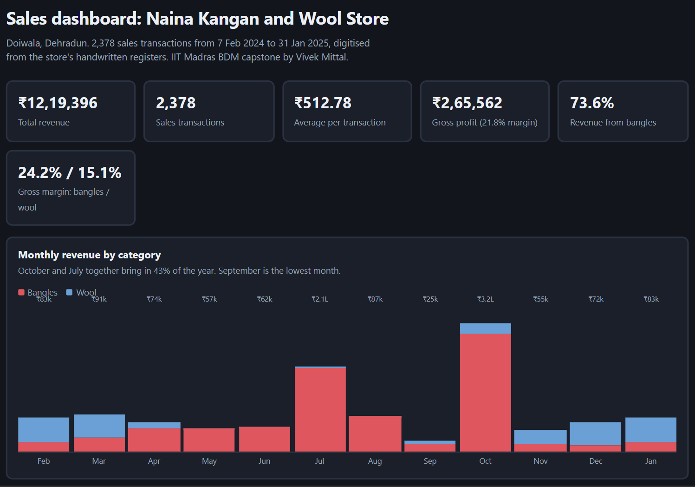

# Sales Insights and Operational Challenges in a Local Bangle and Wool Store

A data analysis project on **Naina Kangan and Wool Store** (New Market, Doiwala, Dehradun, Uttarakhand), a small family-run shop that sells bangles wholesale and wool retail. Built as the capstone for the **IIT Madras Online BS Degree Program (Business Data Management)**.

**[View the live dashboard](https://23f1001475.github.io/Business-Data-Management-Capstone-Project/)**



---

## Summary

I digitised one year of handwritten sales registers (7 Feb 2024 to 31 Jan 2025) and analysed them to find out when, what and to whom the store sells, and where its operations can improve.

| Metric | Value |
|---|---|
| Sales transactions | 2,378 |
| Total revenue | ₹12,19,396 |
| Gross profit | ₹2,65,562 (21.8% margin) |
| Average transaction | ₹512.78 |
| Closed days (not counted as transactions) | 46 |

## The problem

The owner runs the shop on experience and intuition. Three problems came out of that:

1. **Seasonal sales swings.** Stock planning is based on assumptions, not past demand.
2. **Unsystematic stock handling.** Some items are overstocked while others run out in peak months.
3. **Limited customer channels.** The shop relies on word of mouth and keeps no customer records.

## Data

- **Source:** the store's handwritten daily bookkeeping, typed into Excel by me and checked against the originals.
- **Fields:** date, month, season, product category and type, quantity, unit, price, cost, revenue, gross profit, customer type (B2B/B2C), payment mode.
- **Cleaning:** standardised product names and units, validated revenue and profit calculations, separated 46 closed-day rows from the sales records, and corrected one mis-tagged entry (a wool sale recorded under bangles). No sales values were changed.
- **Not available:** customer identifiers, so repeat-buyer and RFM analysis was not possible.

## Methods

- Descriptive statistics (central tendency, spread, frequency)
- Monthly and seasonal aggregation, with a seasonal index
- Segmentation by product category and customer type (B2B vs B2C)
- Pareto analysis of transaction revenue
- ABC-XYZ inventory classification (ABC by revenue share, XYZ by variation in monthly demand)
- **Tools:** Microsoft Excel (formulas, pivot tables, charts); headline figures cross-checked in Python; dashboard built with plain HTML, CSS and JavaScript

## Key findings

- **The business is highly seasonal.** October (₹3,19,897) and July (₹2,09,570) together make up 43% of annual revenue. September is the lowest month at ₹24,990.
- **Bangles drive revenue and profit.** They bring in 73.6% of revenue and carry a higher gross margin than wool (24.2% vs 15.1%).
- **Wool fills the winter gap.** It makes up 72% of winter revenue, so the two categories balance each other across the year.
- **Revenue is concentrated by product.** Bangles Box alone is 50.7% of revenue and 53.7% of gross profit.
- **Wholesale matters most.** B2B customers bring 68% of revenue, with a higher average sale (₹633.04 vs ₹365.77 for retail).
- **Most sales are small.** 56% of transactions are under ₹500, while the top 20% of transactions bring in 44.6% of revenue.
- **Cash dominates.** About 95% of transactions are cash, which limits traceability.
- **ABC-XYZ:** four products (Bangles Box, Wool Ball q2, Wool Ball q1, Bangles Set) make up 79% of revenue. No product has stable demand.

## Recommendations

1. Use simple seasonal forecasting (monthly seasonal index or moving average) to plan stock.
2. Stock by ABC-XYZ class: pre-book Class A items before peak months, order Class C items only on demand.
3. Buy bangle stock ahead of July and October, and wool ahead of November.
4. Keep basic records of wholesale customers so repeat buyers can be identified.
5. Move gradually towards digital payments for better record keeping.
6. Use WhatsApp Business and a Google Business Profile for low-cost reach.

## Limitations

- Only one year of data, so seasonal patterns describe this year and are not a validated forecast.
- No customer identifiers, so retention and RFM could not be analysed.
- Units differ across products (boxes, yarn, packets, pieces), so revenue, not quantity, is the fair comparison.
- Data was typed in by hand from handwritten registers.

## Repository contents

```
.
├── index.html          # Interactive dashboard (served by GitHub Pages)
├── data/               # Cleaned sales data (Excel)
├── reports/            # Proposal, mid-term and final reports (PDF)
├── presentation/       # Final project presentation (PDF)
└── screenshots/        # Images used in this README
```

## Run the dashboard locally

No installation is needed. Download the repo and open `index.html` in any browser.

## Author

**Vivek Mittal**

* [LinkedIn](https://www.linkedin.com/in/vivek-mittal-574a31250/)
* [GitHub](https://github.com/23f1001475)


## Disclaimer

The recommendations are specific to this business and this project. This work is not endorsed by IIT Madras. Data is shared with the store owner's permission.
